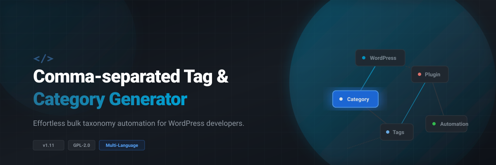

<p align="center">
  
</p>

# Comma-separated Tag and Category Generator

<p align="center" style="display: flex; flex-wrap: wrap; justify-content: center; gap: 10px;">
  
  
  
  
</p>

---

## 🚀 Description

The **Comma-separated Tag and Category Generator** simplifies taxonomy management in WordPress. Instead of creating tags and categories one by one, you can input or configure a bulk list separated by commas, and the plugin will seamlessly handle the generation process.

---

## ✨ Features

* **📦 Bulk Generation:** Instantly convert any comma-separated list into official WordPress tags or categories.
* **⚙️ Configurable Setup:** Easily define and manage your input lists directly within the WordPress admin dashboard.
* **🌐 Multi-Language Support:** Fully localized for English, Deutsch, Français, and Italiano.
* **⚡ Clean Performance:** Lightweight execution that integrates natively with the core WordPress database structure.

---

## 🛠️ Installation

1. **Download** the plugin repository as a `.zip` file.
2. Log in to your **WordPress Admin Dashboard**.
3. Navigate to **Plugins** > **Add New** > **Upload Plugin**.
4. Choose the downloaded `.zip` file and click **Install Now**.
5. Click **Activate Plugin**.

---

## 📖 Usage

1. Navigate to the **Tag & Category Generator** settings page in your WordPress sidebar.
2. Choose whether you want to generate **Categories** or **Tags**.
3. Input your terms as a single line or block text, separated by commas:
   ```text
   WordPress, Open Source, Development, Plugins, Automation
   ```
4. Click **Generate** to apply the changes instantly.

---

## 📋 Technical Specifications

| Property | Value |
| :--- | :--- |
| **Plugin Name** | Comma-separated Tag and Category Generator |
| **Version** | 1.11 |
| **Author** | Gottfried Aumann |
| **Author URI** | [gancpt.at](https://gancpt.at) |
| **Plugin URI** | [gancpt.at](https://gancpt.at) |
| **License** | GPL2 |

---

## ⚖️ License

This project is licensed under the GPL2 License. Feel free to use, modify, and distribute it in accordance with open-source standards.
